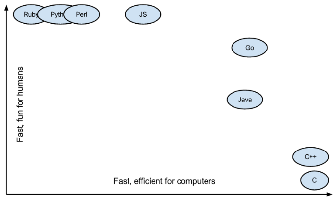
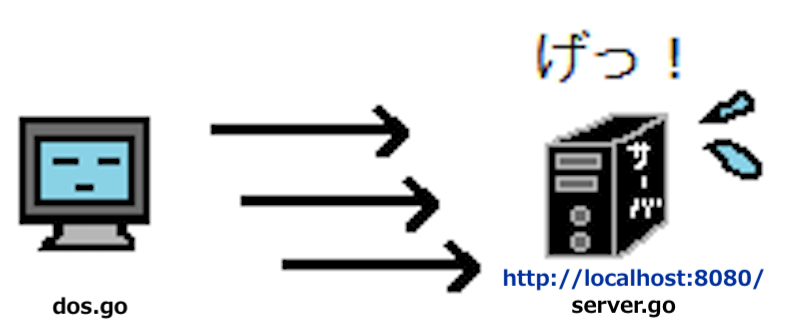

<!-- page_number: true -->

# Goで始める毎分100万回DoS攻撃
---

# Goってなに？
- Googleがつくったすごい言語
- Python並に読みやすい、C並に速い

###### 参考：[Why should you learn Go? – Keval Patel – Medium](https://medium.com/@kevalpatel2106/why-should-you-learn-go-f607681fad65)
---

# なにがつくれる？
- Webアプリ
	- YouTubeはGoで書かれている
- ソフトウェア
	- Windows, Linux, Macを同じコードで書ける
	- Android, iOSを同じコードで書ける
- PaaS
	- Docker, KubernetesはGoで書かれている
###### 参考：[go言語（golang）の特徴って？メリットとデメリットをまとめてみた](https://itpropartners.com/blog/10984/)
---

# なんでGo？
<strong style="text-align:center; font-size:130px;">
並列処理が簡単に書ける!!!!!
</strong>

---

# ==DoS攻撃==をやってみる


###### 参考：[DDoS攻撃とは｜「分かりそう」で「分からない」でも「分かった」気になれるIT用語辞典](https://wa3.i-3-i.info/word11008.html)
---

# ローカルにサーバを立てる
- server.go

	``` go:server.go
	package main

	import (
	    "fmt"
	    "net/http"
	)

	func handler(w http.ResponseWriter, r *http.Request) {
	    fmt.Fprintf(w, "Hello, World")
	}

	func main() {
	http.HandleFunc("/", handler)
	    http.ListenAndServe(":8080", nil)
	}
	```
    
	実行
    
    ```
    $ go run server.go
    ```

---

# DoS攻撃する
- dos.go

	``` go:dos.go
	package main

	import (
 	   "net/http"
 	   "io/ioutil"
 	   "fmt"
	)

	func main() {
 	   url := "http://localhost:8080"

 	   resp, err := http.Get(url)
 	   if err != nil {
 	       panic(err)
 	   }
 	   defer resp.Body.Close()

 	   byteArray, err := ioutil.ReadAll(resp.Body)
 	   if err != nil {
	        panic(err)
	    }
	    fmt.Println(string(byteArray))
	}
	```
